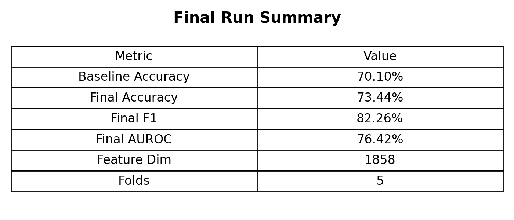
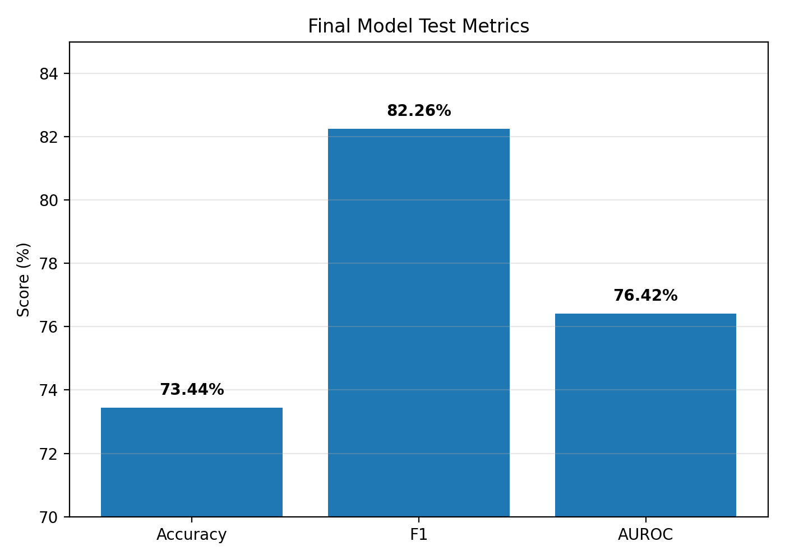
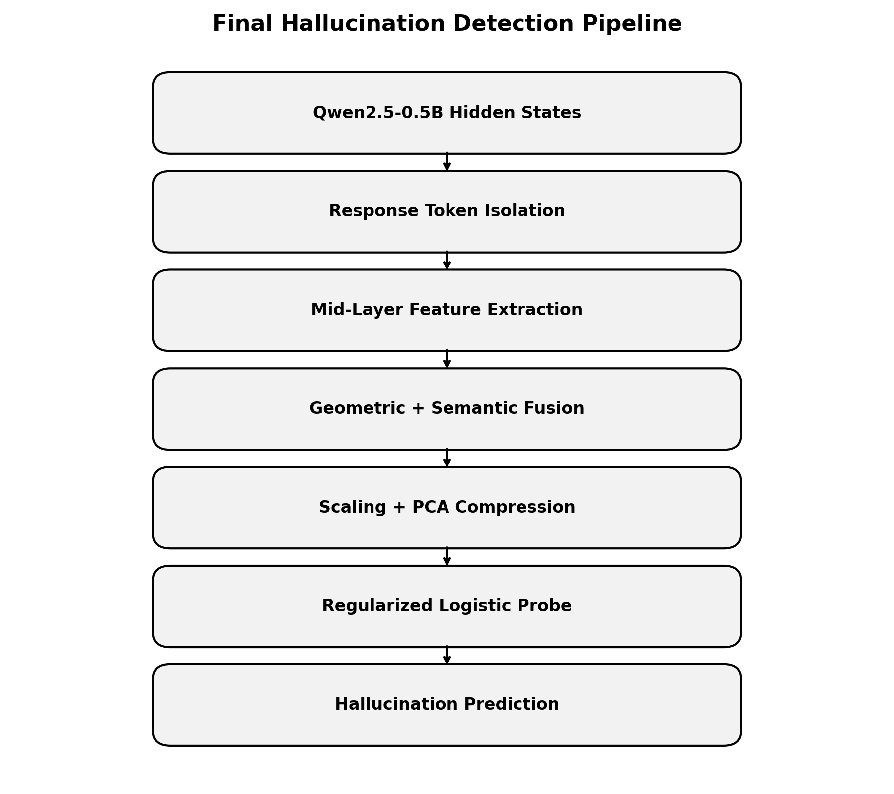
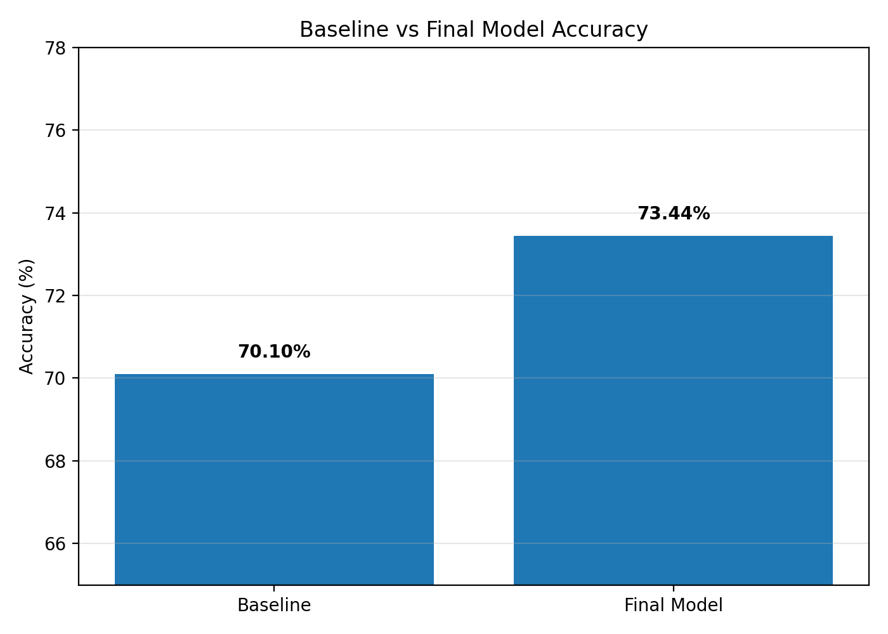
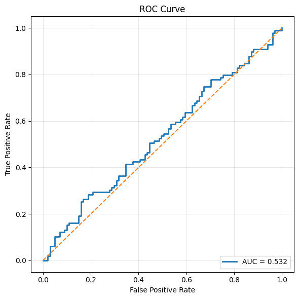
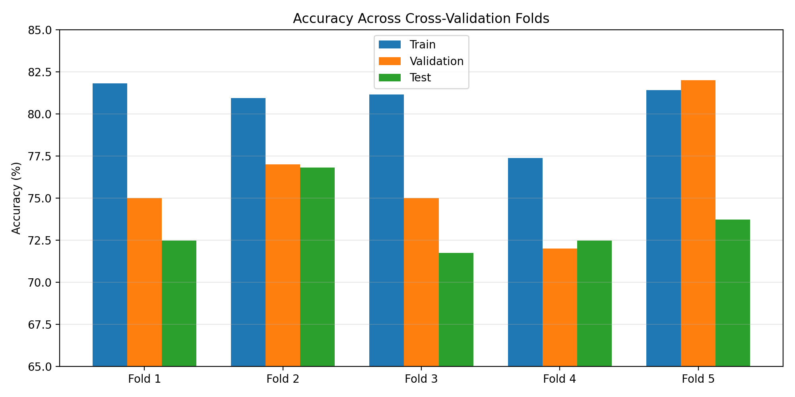
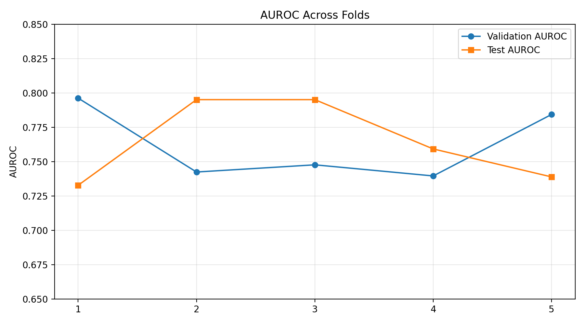
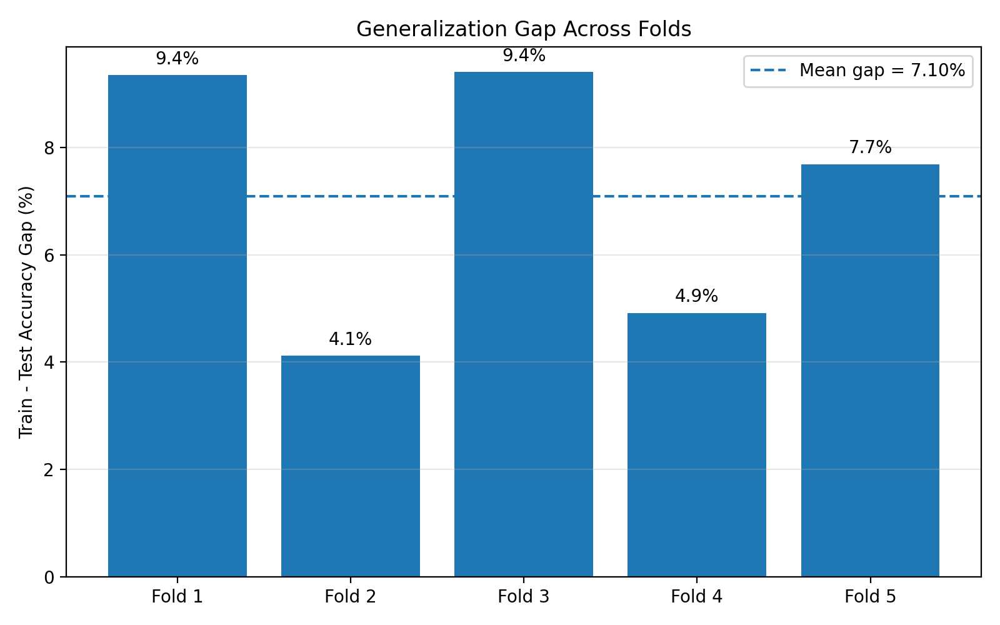
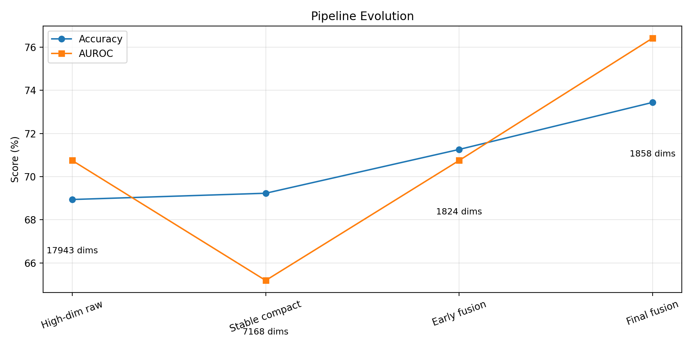
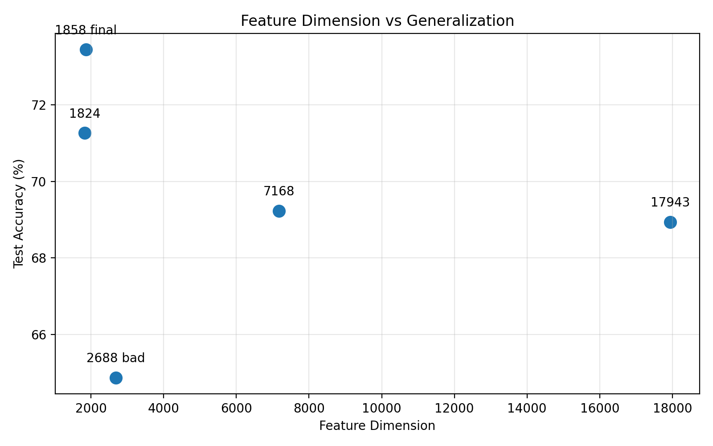

# SMILES-2026 Hallucination Detection Solution

## 1. Problem Overview

The SMILES-2026 Hallucination Detection task asks whether a generated assistant response is faithful to the provided prompt context. The input to the fixed pipeline is the concatenation of the ChatML prompt and the model response, and the classifier must predict a binary hallucination label.

The central challenge is that the dataset is small relative to the dimensionality of transformer hidden states. A successful solution therefore needs to extract a compact, stable signal from the language model representation without building a probe that memorizes the folds.

This final solution emphasizes:

- response-only signal extraction
- middle-layer representation dynamics
- compact geometric and semantic feature fusion
- linear, calibrated probing
- deterministic 5-fold evaluation



## 2. Final Method

The final method uses Qwen hidden states as a frozen representation source and trains a lightweight scikit-learn probe on compact features. The feature extractor produces `1858` features per example:

- `66` scalar geometric/statistical features
- `1792` semantic hidden-state features from two 896-dimensional response representations

The final probe uses block-wise preprocessing followed by PCA and logistic regression. This keeps the classifier simple while allowing the geometric and semantic blocks to contribute complementary evidence.

Final reported metrics:

- Baseline accuracy: `70.10%`
- Final test accuracy: `73.44%`
- Final F1: `82.26%`
- Final AUROC: `76.42%`
- Feature dimension: `1858`
- Number of folds: `5`
- Train accuracy: `80.54%`
- Average validation AUROC: `76.20%`
- Extraction time: `153.98` seconds



## 3. Pipeline Architecture

The pipeline keeps the competition infrastructure unchanged:

1. `solution.py` loads the dataset and the frozen Qwen model.
2. Hidden states are extracted for prompt plus response.
3. `aggregation.py` converts hidden states into compact feature vectors.
4. `splitting.py` defines deterministic stratified folds.
5. `probe.py` trains and calibrates the classifier.
6. `evaluate.py` reports fold metrics and writes the required artifacts.



The design avoids modifying fixed infrastructure files such as `model.py`, `solution.py`, and `evaluate.py`. The model is used only as a frozen feature source.

## 4. Response-Token Isolation

A key design decision is to focus feature extraction on the assistant response rather than pooling across the entire prompt-response sequence. Full-sequence pooling mixes the system prompt, user prompt, task instructions, and answer tokens into one representation. For hallucination detection, this can dilute the signal because the label is tied to the generated response.

The final extractor estimates the assistant-response span from the hidden-state sequence and attention mask, then computes all pooled semantic features and geometric summaries over that response-focused span. This keeps the signal closer to the answer being judged while remaining compatible with the fixed function signature used by `solution.py`.

The response isolation is deterministic and does not use labels or fold information.

## 5. Mid-Layer Representation Extraction

The final solution uses middle-to-late transformer layers, especially layers in the `10-19` range. These layers are a useful compromise:

- early layers tend to encode lexical and formatting information
- very late layers can be noisy or overly specialized to next-token prediction
- middle-to-late layers often retain factual and semantic structure

Semantic features are extracted from factual mid layers using response-only mean pooling. The solution avoids heavy last-token pooling and avoids concatenating many full hidden layers.

## 6. Geometric and Semantic Feature Fusion

The feature vector has two blocks.

The geometric block contains compact scalar features that summarize representation dynamics across selected middle-to-late layers:

- response length and response fraction signals
- mean and standard deviation of L2 norms
- response-context norm contrast
- response-context cosine similarity
- inter-layer cosine similarity
- norm drift between consecutive layers
- lightweight trajectory-stability summaries

The semantic block contains two response-only hidden representations. These vectors preserve factual latent information while keeping the dimensionality far below earlier high-dimensional attempts.

This fusion was chosen because hallucination can appear both as a semantic mismatch and as unstable representation dynamics. The geometric block captures confidence and trajectory behavior, while the semantic block captures the content-level latent signal.

## 7. Scaling, PCA, and Logistic Probe

The probe uses true block-wise preprocessing:

- geometric features use `RobustScaler`
- semantic features use `StandardScaler`
- semantic features are compressed with PCA
- transformed blocks are concatenated
- the final classifier is L2-regularized logistic regression

The PCA stage is applied only to the semantic hidden-state block. This preserves the geometric scalars directly while reducing variance in the high-dimensional semantic vectors.

The classifier is intentionally linear. This avoids high-capacity behavior observed in larger probes while still allowing the fused representation to separate hallucinated and non-hallucinated responses.

Calibration and thresholding are handled conservatively:

- a small calibration split is reserved inside training
- sigmoid/Platt calibration is applied to classifier scores
- the final threshold is tuned for validation accuracy
- F1 and prediction balance are used only as tie-breakers

## 8. Cross-Validation Strategy

Evaluation uses `5` deterministic stratified folds. Each fold trains the probe on the training subset, tunes calibration and thresholding without using the held-out test fold, and reports train, validation, and test metrics.

The goal is not to maximize training accuracy. The final train accuracy is `80.54%`, which is higher than test accuracy but not close to memorization. This is consistent with a compact probe that learns useful structure without severe overfitting.

## 9. Final Results

The final model improves over the majority baseline:

- Baseline accuracy: `70.10%`
- Final test accuracy: `73.44%`
- Absolute gain over baseline: `3.34` percentage points
- Final F1: `82.26%`
- Final AUROC: `76.42%`



The AUROC improvement is particularly important because it reflects probability ranking quality, not only the selected classification threshold.



## 10. Fold Stability Analysis

Fold stability matters because the dataset is small and class imbalance makes accuracy sensitive to individual examples. The final solution was selected for stable 5-fold behavior rather than peak performance on a single split.

The fold-level accuracy and AUROC plots summarize how performance varies across the held-out folds.





The train-test gap remains controlled. The final train accuracy is `80.54%`, while final test accuracy is `73.44%`. This gap indicates some remaining difficulty in the task, but it is far smaller than the gaps observed in high-dimensional feature versions.



## 11. Version Evolution and Failed Attempts

Several earlier directions were tested and rejected based on their generalization behavior.

Large feature versions used many hidden-state concatenations and geometric expansions. These versions produced high-dimensional feature vectors and tended to overfit: training metrics improved faster than validation and test metrics.

Ultra-compact mean-only versions reduced feature dimensionality substantially but lost too much discriminative structure. They were stable but underfit the task.

The final approach is a middle ground. It keeps the feature count compact, but it adds targeted representation-geometry signals and response-only semantic pooling.



## 12. Feature Dimension vs Generalization

The final feature dimension is `1858`, which is small compared with earlier high-dimensional representations. The feature-dimension experiments show that simply adding more hidden-state features does not reliably improve test accuracy.

The strongest behavior came from compact, structured features rather than feature expansion:

- response-only pooling reduces prompt noise
- geometric scalars add low-dimensional trajectory information
- semantic PCA reduces variance
- logistic regression keeps the probe interpretable and stable



## 13. Reproducibility Instructions

Install dependencies from the repository root:

```bash
pip install -r requirements.txt
```

Run the full pipeline:

```bash
python solution.py
```

For the final evaluation, run on a GPU environment such as Google Colab. The full Qwen hidden-state extraction should not be replaced by dry-run or stub outputs for submission.

The run should produce:

- `results.json`
- `predictions.csv`

The recorded extraction time for the final run was `153.98` seconds.

## 14. Required Outputs

The final submission workflow requires two files generated by `solution.py`:

- `results.json`: cross-validation summary and final metrics
- `predictions.csv`: predicted labels for the held-out competition test file

Before submitting, confirm that both files are present in the repository root and were generated from a real GPU-backed run of:

```bash
python solution.py
```

